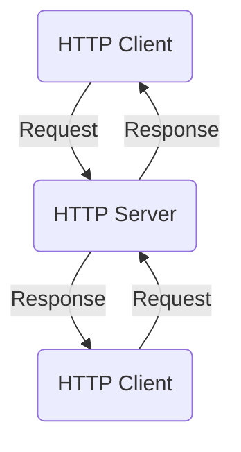
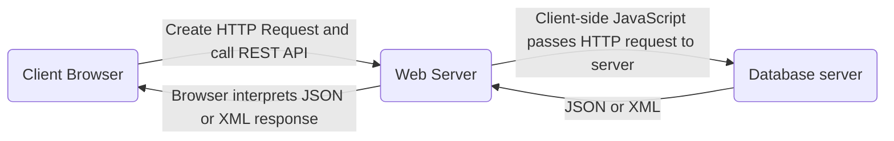

# Client server model
Network services are designed to act as on-demand services where the server is responsible for the bulk of the processing. A server presents its services to requesting clients. If the request cannot be fulfilled a suitable notification will be sent. 

## API
Application programming interface are a interface to access services of a server. 
- An API is a set of functions and protocols that clients can use.
- A server-side web API is a set of web services or web resources to enable programmers to build web applications.
- Multiple server-side APIs used to create a web application are called mashups

### HTTP Communication
HTTP communication is limited as the client has to "pull" data from the server and if too much time passes before establishing a socket connection between client and web server, and receipt of a client request, the server drops the connection to conserve its resources and returns an error message.

## WebSocket protocol
WebSocket protocol includes API for establishing a persistent TCP socket connection. It is designed for web browser and server but any type of client and server can use it.
WebSocket connections are **full-duplex** meaning that the client and server can send data each way any time. 

### Benefits
As a websocket broadcast does not need to send the usual headers, the connection is usually faster due to smaller packets.

## CRUD
There are four basic data manipulation operations.
- Create - Write a record.
- Retrieve - Retrieve a record.
- Update - Amend a record.
- Delete - Remove a record.

HTTP maps to this with GET, POST, PUT, DELETE.
|CRUD|HTTP Request methods|SQL database command|
| Crud |HTTP Request methods | SQL database command |
|--|--| -- |
|Create	|POST	|INSERT	|
|Retrieve  |GET  |SELECT	|
|Update | PUT | UPDATE |
| Delete | DELETE | DELETE |

## Representational state transfer (REST)
REST architectural style which determines how systems communicate with each other. Typically REST uses HTTP request methods to interact with online databases. RESTful systems and APIs separate the client from the server database allowing either to be updated independently without impacting on the other.

## JSON and XML
There are two widely used formats for data interchange between clients and servers:
1. JavaScript Object Notation (JSON) is written in a standard programming form, similar to JavaScript, and can be directly used by JavaScript with many other languages able to read and write it.
2. Extensible Markup Language (XML) is a format similar to HTML and wraps content in tags.

JSON is generally prefered as it is easier for a human to read and write, requires less storage and can be directly manipulated by JavaScript.

## Thick/Thin clients
The easiest way of implementing a network is to use standard computers as hosts and join them via a network medium. Each host on the network would be a powerful computer in its own right. This is known as a thick client. 
An alternative is to use low-powered processors in hosts specifically designed as network machines.

