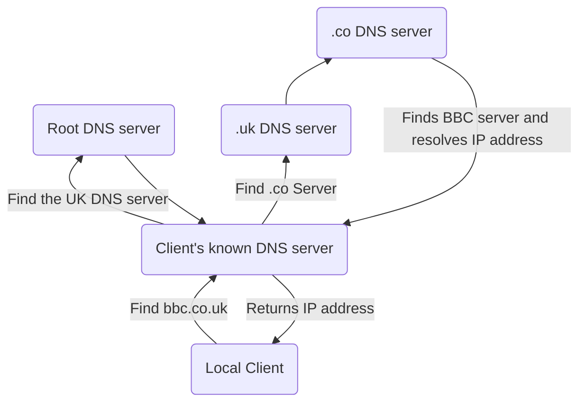

Computers communicate with each other using networks.

The largest public network in the world is called the Internet.

## The Internet

The internet is a network of Inter-connected Networks.

The world wide web is a collection of resources accessed via the Internet.

### Backbone

The main part of the internet is known as the backbone. This is a set of dedicated connections that connect several large networks at various points on the globe.

Each of these points are then connected to other regional networks usually, controlled by Internet Service Providers (ISPs).

ISPs provides access to individual end-users

### Internet Addresses

Each device on a network needs to be uniquely identified so that data can be sent to the correct destination much like an address on a letter.

#### IP Addressing

IP Version 4 (IPv4) addresses are made up of four octet values separated by a full-stop. This only allows 3.4 Billion addresses.

There are no longer enough IPv4 addresses available so Version 6 (IPv6) is used to extend this.

### Uniform Resource Locator

URLs are used to specify the means of accessing a resource and its location across a network. The protocol and the domain name of the resource together form the URL.

### Domain Name System (DNS)

DNS servers are dedicated computers with an index of domain names and their corresponding IP addresses. We use DNSs because ip addresses are not static by default and are able to change. It is also not user friendly to remember ip addresses.

### Internet Registries

Domain names must be unique otherwise DNS requests could be confused.

There are only 5 Internet Registries:

1. ARIN (North America)
2. LACNIC (South America)
3. RIPE NCC (Europe)
4. APNIC (Asia)
5. AFRINIC (Africa)

However you mainly buy domain names from internet registrars.
