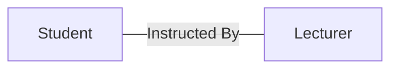
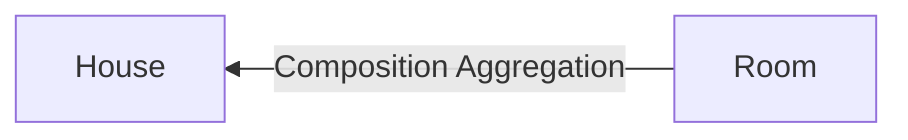

## Association
In OOP objects can be related in different ways. The "Is a" relationship ([[4. Inheritance|Inheritance]]) is only one of these.
- Association in OOP is how two or more objects are related to each other. Could be one to one, one to many.
- Generally the name of the association will specify the relationship between the objects. It may be a dependency relationship.
- In a class diagram this association is shown with a solid line.

## Association Aggregation
- Aggregation is a way of creating new objects that contain objects which already exist.
- Association aggregation is when an object which contains other objects is destroyed, the other objects will still exist

The arrow is supposed to be an open diamond.

## Composition Aggregation
- This is when an object that contains other objects and if destroyed, then the objects will no longer exist.
- In other words the child object cannot exist without the parent object, so the association is strong

The arrow is supposed to be a closed diamond.

