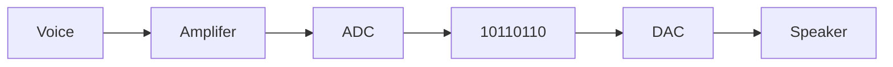

Real-world data is usually analogue in nature with values that vary by any amount over time. Sound is a result of changes in air pressure, this pressure fluctuations cause our eardrums to vibrate, these nerve signals are interpreted as sound.

![[Pasted image 20221110094758.png]]

## Analogue to Digital Conversion

Analogue sounds samples are recorded via an amplifier. Each sample is quantised to measure its wave height and translate this into an integer value. The integer value is then converted and stored digitally as a binary value.

### Sampling

An analogue signal is measured at regular periods. The number of bits used to record each measurement is known as the resolution. More bits used per sample enables the height of thew ave to be more accurately measured at the cost of an increased file size.

![[Pasted image 20221110093049.png]]

The frequency or the sample rate per second affects the level of detail in the digital representation. The greater the frequency, the greater the accuracy and file size.

## File Size

The sampling rate and the resolution allow us to determine the size of file required to create a digital copy of the sound waves.

Sampling rate indicates number of samples per second (Hertz)

Resolution is the number of bits used per sample.

File Size = Sample Rate x Resolution x Length in seconds

## Real Sound

Sound in the real-world is made up of combinations of different frequencies. A sound wave is a combination of these different frequencies.

There is a limit on the lowest sampling rate that can be used for an accurate recording.

Fs > 2fmax.

### Nyquist's Theorem

Because sound is made up of many components each at different frequencies, samples must be twice the highest frequency in order to replicate the original sound wave.

### The Human Ear

The human ear can only hear frequencies of between 20hz and 22kHz. This gets worse as we get old.

## MIDI

The MIDI standard (Musical instrument digital interface) creates sounds as requested either from an instrument of piece of software. Not a live recording but rather a synthesised sound.

### MIDI Benefits

With this system the full sound signal does not need to be transmitted, only the instructions to play the sound need to be transmitted as 'event messages'. It is up to the instrument to create the sound. MIDI messages are usually 2 or 3 bytes long which significantly reduces the amount of data transferred. As sounds are synthesised they may be less realistic but since no data is lost about musical notes, the quality can be higher.

### Event Messages

A sound processor can be linked to several instruments or computers which can send a timed sequence of event messages to synchronise tempo, control pitch, change volume or introduce and silence other instruments in a digital orchestra.
