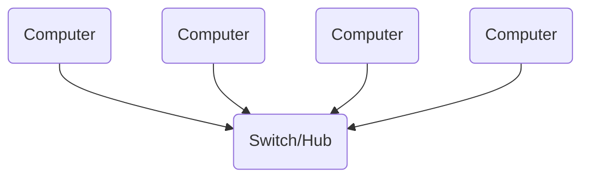

One computer not connected to any other computing device is called a 'standalone'. As soon as you connect two or more computers together they form a network. All networks are either a local area network or a wide area network.

## Local Area Networks

Two or more computers connected together within a small geographical area ie a building.

## Network Topologies

A network topology is the arrangement of the various computing devices which make up a computer network.

- Bus topology: Nodes are connected in a daisy chain by a single communications channel. [[#Bus Network]]

- Star topology: An arrangement where a central node or hub provides a common connection point for all other nodes. [[#Star Network]]

### Bus Network

All nodes are connected to a single backbone cable. Each end of the backbone is connected to either a terminator or a computer which stops signals 'bouncing back'. Each node is passive. Data is sent in one direction at a time only. Only one computer can transmit successfully at any one time.

| Advantages                  | Disadvantages                        |
| --------------------------- | ------------------------------------ |
| Inexpensive to set up       | Main cable is a point of failure     |
| Devices can easily be added | Limited cable length                 |
| Good for small networks     | Performance degrades with heavy use. |
|                             | Poor security                        |

### Star Network

Computers are connected to a central node. This is often either a hub or a switch.

A switch sends each communication to the specific computer it is intended for. A hub broadcasts the message to every computer on the LAN.

| Advantages                                                            | Disadvantages                                        |
| --------------------------------------------------------------------- | ---------------------------------------------------- |
| Easy to isolate problems                                              | Can be expensive to setup because of length of cable |
| Good performance                                                      | Central device is point of failure                   |
| More secure if a switch is used as data is only sent to the recipient |                                                      |

## MAC Addressing

Every networked device contains a network interface card (NIC)

Each NIC is attributed a unique media access control (MAC) hard coded in manufacture.

## Physical Vs Logical Topology

The physical topology of a network defines how the devices are physically connected.

The logical topology defines how the devices communicate across the physical topologies.
