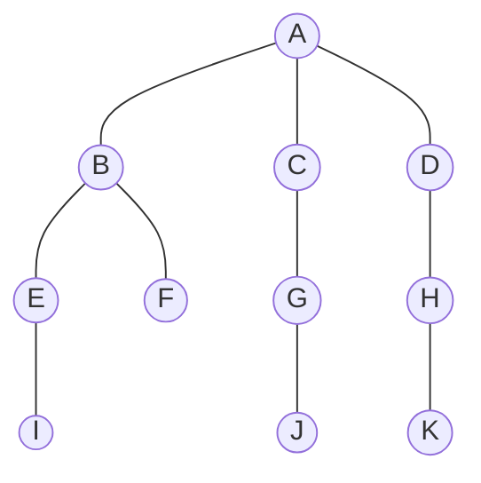
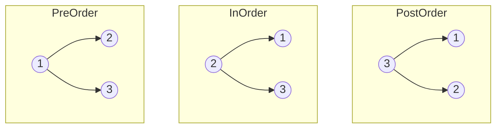
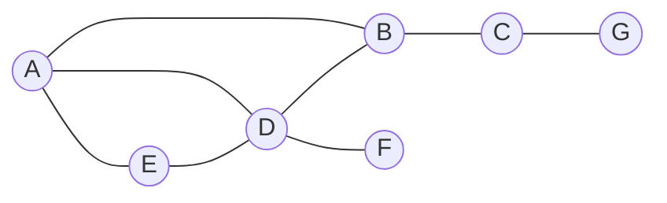

## Graphs

A graph is a diagram consisting of circles, called vertices, joined by lines called edges. It is an abstract data structure that can be used to represent a wide range of different systems. A common type of graph is a tree.

### Trees

A tree is a common abstract data type (ADT).

A tree is a connected, undirected graph with no cycles.

A rooted tree is a tree but one that has an identified root, so every node has a unique parent apart from the root.

A binary tree is a rooted tree in which each node has a maximum of two children.

A balanced binary tree is a tree where the nodes are distributed in such a way that the height is kept to a minimum, allowing for more efficient searching.

A binary tree can be traversed in three different ways:

### Graph Traversal Algorithms

There are two ways of traversing a graph:

- Depth-first, going down as far as you can down a path before back tracking and going down the next.
- Breath-first, exploring all of the neighbours of the current vertex then the neighbours of each vertex after that.

Depth first: A, B, C, G, D, F, E

Breadth first: A, B, D, E, C, F, G

#TODO
