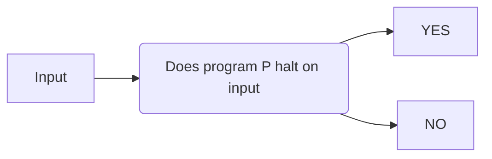

A problem is defined as being computable if there is an algorithm that can solve every instance of it in a finite number of steps.

Some problems may be theoretically soluble by computer but if they take millions of years to solve they are in practical sense insoluble

Limits are imposed by algorithmic complexity and hardware.

## The Travelling Salesman Problem

"Given a list of towns and the distances between each pair of towns, what is the shortest possible route that the salesman can use to visit each town exactly once and return to the starting point"

The TSP is a very well known optimisation problem. A problem finding the best solution out of all feasible solutions

### Brute Force

One way of attempting to solve the problem is to test all possible routes. This applied to TSP results with N! (where N = number of cities) possible routes

The problem quickly becomes impossible to solve within a reasonable time.This is an example of an intractable problem.

## Tractable Problems

A problem that has a polynomial-time solution or better is called a tractable problem. Time complexities like O(n) -> O(n^k) are all efficient algorithms for solving problems

## Intractable Problems

An intractable problem is one that does not have a polynomial time solution ie O(2^n) -> O(n!) are all inefficient algorithms. Although possible to solve, it is impossible to solve it within a reasonable time for values of n greater than something very small.

## Heuristic Methods

Not all intractable problems are equally hard. It may be relatively easy to get an approximate answer that is good enough. A heuristic approach is one which tries to find a solution which may not be perfect but which is adequate for tits purpose.

A heuristic approach is often used in decision making:

- Using a rule of thumb
- Making an educated guess
- Using common sense

Researchers have found that ignoring some of the relevant information can lead to better decisions.

## Non-computable Problems

Some problems cannot be solved arithmetically. Problems such as face-recognition or flying an airliner without human intervention may once have seemed non-computable but now are routine.

### The Halting Problem

This is the problem of determining for a given input, whether a program will finish running or continue forever.

Alan Turing proved that a machine to solve the halting problem for all possible programs and their inputs, cannot exist.

this problem shows is that there are some problems that cannot be solved by the computer.
