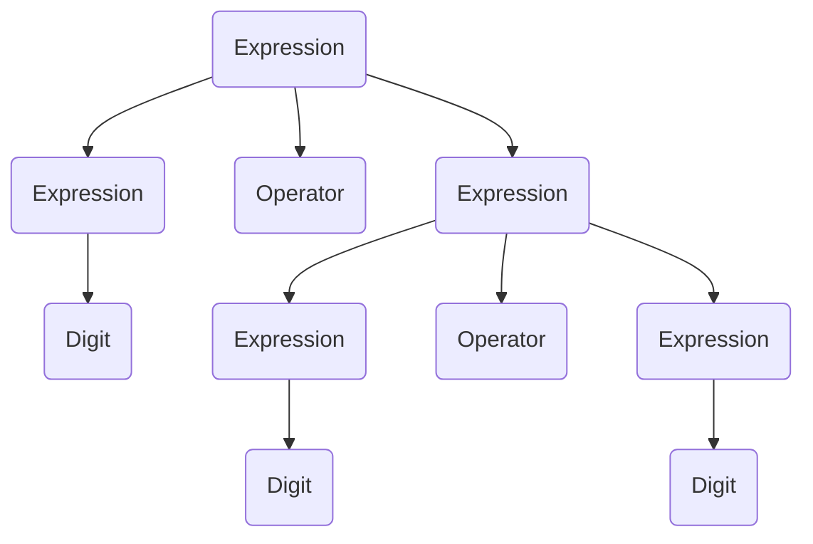

BNF is a meta-language : a language that describes the syntax of the language.
We need BNF because regular languages are expressible by regex, but some languages cannot be expressed by a regex expression. The class of languages called context-free languages is more expressive than regular languages. BNF is a way to define these context-free languages.

| symbol               | meaning                   |
| -------------------- | ------------------------- |
| \:\:\=               | is defined as             |
| \|                   | or                        |
| \<\>                 | surrounds category names  |
| side by side         | items must follow exactly |
| terminal symbols     | cannot be further broken down                          |
| non-terminal symbols | can be further broken down                          |

digit ::= 0|1|2|3|4|5|6|7|8|9
numbers ::= digit digit

## Language representations

An instruction for a computer must not be ambiguous in any way.
A programming language requires strict and precise rules. That is why BNF is used by compiler writers to represent the precise syntax of a programming language.

## Production Rules

Each individual BNF statement is called a 'production rule'. A common example of production rules:

\<digit> ::= 0|1|2|3|4|5|6|7|8|9

\<upper> ::= A|B|C|D|E|F|G|H|I|J|K|L|M|N|O|P|Q|R|S|T|U|V|W|X|Y|Z

\<lower > ::= a|b|c|d|e|f|g|h|i|j|k|l|m|n|o|p|q|r|s|t|u|v|w|x|y|z

\<space> ::= ‘ ’

\<letter> ::= \<upper> | \<lower>

## Parsing

The act of parsing is checking an input string against the set of BNF rules to see if it is valid. When a compiler or interpreter encounters an input, it validates the input by building a tree according to the BNF rules. Example:

\<expression> ::= \<digit> | (\<expression>\<operator>\<expression>)
\<digit> ::= 0|1|2|3|4|5|6|7|8|9
\<operator> ::= + | -

## Syntax Diagram

Another way to represent context-free languages, a graphical equilivent of BNF.
![[Pasted image 20221103035403.png]]
![[Pasted image 20221103035425.png]]