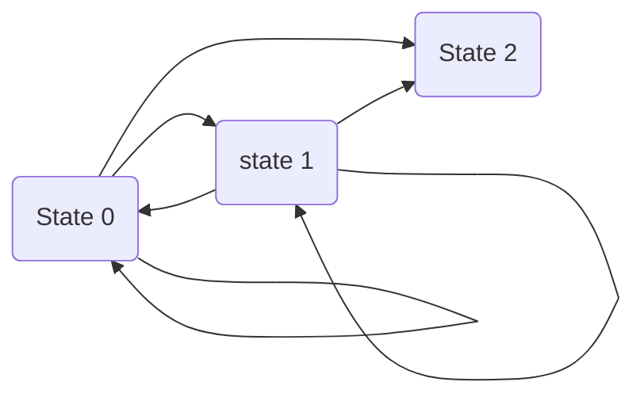

#Remake

The Turing machine is a theoretical abstract machine, developed in the 1930s underpinning the dominant technology of the model world, the digital general purpose computer.

A Turing machine consists of a read-write head, an infinitely long tape and a control unit.



A turing machine is a formal model of computation that consists of a finite state machine, a read/write head and a tape that is infinitely long in one direction.

The tape is divided into cells each of which can be left blank or contain a symbol. Symbols are written to and removed from cells on the tape by the turing machine's read/write head. The set of symbols that a turing machine uses is called its alphabet and must be finite.

A turing machine can be viewed as a computer which runs a single program, as defined by finite state machines. The finite state machine will have a start state and may have a number of states from which there are no transitions referred to as halting states.

Turing machines stop after reaching their halting state. This state can be entered at any point in the machine's execution of its input data and is entered once all of the input data has been processed.

A turing machine can be represented graphically as a series of cells, each containing a symbol and a triangular pointer which represents the position of the machines read/write head. A `[]` Symbol signifies an empty cell.

As a model of computation turing machines are more powerful than finite state machines. This is because they can utilise a greater range of languages than finite state machines and because their tape is infinitely long in one direction.

The Turing machine also has a set of instructions which tells the machine what to do when it finds itself in a particular state.

These instructions are called transition rules. They can be expressed in the form of a transition function:

```
δ (current state, input symbol) = (next state, output symbol, movement)
```

A description of some of the transition rules for the parity calculating.

Universal turing machines.

Turing machines are limited to following just one finite state machine, making them specific to the computational problem they need to solve.

Universal turing machines are capable of representing any finite state machine. A description of the finite state machine to be used is read off of the same tape as the input data and then used to process the input data as usual.

Universal turing machines can be said to act as interpreters because of the way they read their instructions in sequence before executing operations on their input data.

The importance.

Turing machine provide a formal model of computation and therefore a definition of what is computable. The real importance of this to the subject of computation is that Turing machines can prove that there are problems which cannot be solved by computers.
