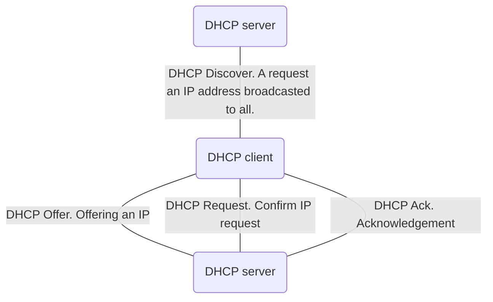

An IP addresses is a unique numerical address.  It is used to identify a host computer or network node trying to communicate over IP on a network.

## IPv4
The IPv4 Standard uses four octets (groups of 8 bits) in a decimal-dotted notation.
Some addresses are unable to be used.
IPv4 only provides a maximum of 2^32 or 256^4 addresses which is not enough for the number of devices on the Internet because of this limitation IPv6 was created.

An IP address consists of two parts:
- Network identifier (Network ID) - (Left side) Used to define the network where nodes are communicating.
- Host identifier (Host ID) - (Right side) used to identify separate nodes on a network.
Since the two IDs occupy complementary sets of bits within the IP address, they can be added together to form the IP address.

## IPv6
IPv6 Standard uses a string of 32 hexadecimal digits. This means that there is 16^32 possible IPv6 addresses.

## Classful IP addressing
IP addresses used to be categorised into classes to identify the network and host IDs of various ranges.
![[Pasted image 20230209093327.png]]

## Classless IP addressing 
The use of a suffix such as /24 enables IP addresses to be used with varying proportions of network ID and host ID. 

## Subnet mask
A subnet mask is used together with an IP address to identify the network identifier within the address. 
The mask has all the network ID bits set to 1 and all host ID bits set to 0 so that when compared to the IP address using a bitwise AND operation, the correct network is identified.
![[Pasted image 20230209093843.png]]

## Subnetting
An organisation can choose to further subdivide the number of available host IDs that they have between individual subnetworks.

## Public and Private IP addresses
IP addresses can be either public or private. These addresses are non-routable across the Internet and are reserved for use within LANs or private WANs.

## Network address translation
Devices using private IP addresses cannot access the internet directly. Instead they communicate via another network device that provides Network address translation (NAT). 
The translation device records the source and destination socket addresses for each request. It then communicates on the host's behalf with the destination IP address. When a response returns it is passed back to the host that made the original request.
![[Pasted image 20230209095628.png]]
NAT can also provide port forwarding.

## DHCP
Dynamic host configuration protocol (DHCP) is used to automatically assign IP addresses and any other network configuration information. This allows limited pools of dynamic IP addresses to be shared out between hosts and freed up when not needed. This also allows hosts to reconfigure themselves when moving between networks and reduces the number of IP addresses required locally as not all hosts will require network access at the same time.

DHCP can assign a limited number of temporary IP addresses to transient devices operating within a local hotspot.

