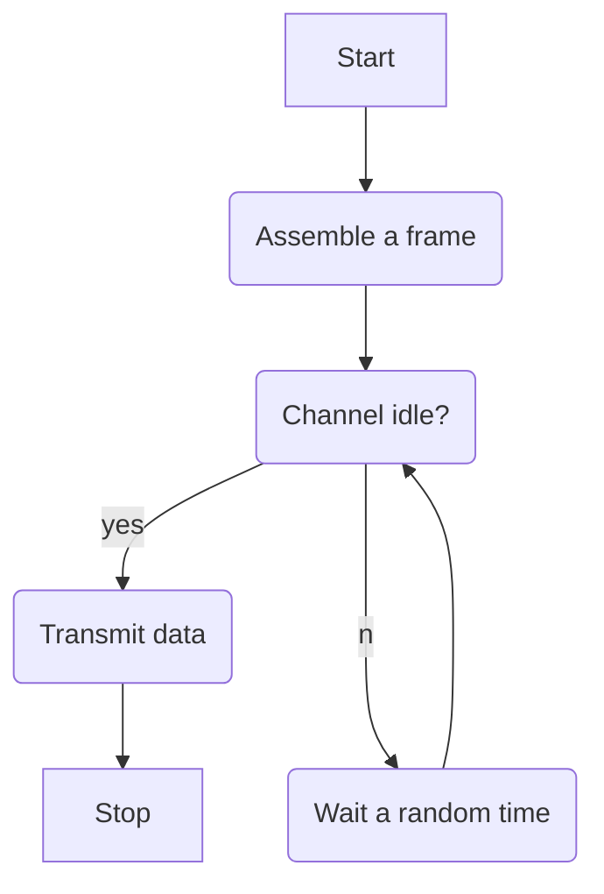
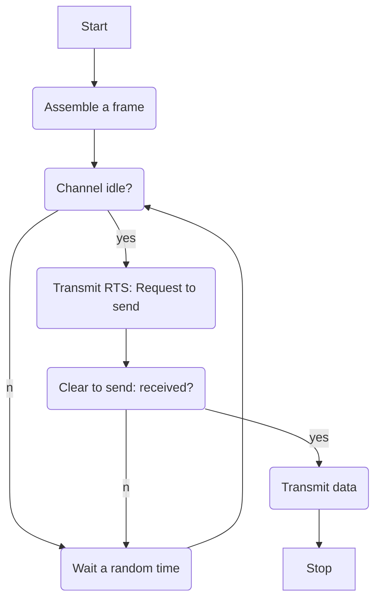

Wi-Fi is a wireless networking technology providing high-speed internet and network connections. Devices can connect to the internet via a wireless network access point (WAP)

### Wireless components
- Wireless network interface card (NIC)
- A station consists of a computer and a NIC
- Stations share a radio frequency channel
- Wireless access point (WAP) requires a connection to a router, and the router requires a connection to a modem.

### Service Set Identifier (SSID)
This is an identifier for each network. It can be set manually or automatically and can be hidden to make it harder to detect. 

### Security
Wireless networks can be less secure than wired ones. Unauthorised users can be hard to spot and transmitted data can be easily intercepted.
You can secure your network with WPA and WPA2 or by whitelisting a few MAC address.

### Multiple stations
Several devices may be able to transmit via a single WAP. To avoid collisions of data we use the protocol **Carrier sense multiple access with collision avoidance** (CSMA/CA)

Collisions are avoided by each station transmitting only when the channel is idle.

This can be better by using RTS/CTS

