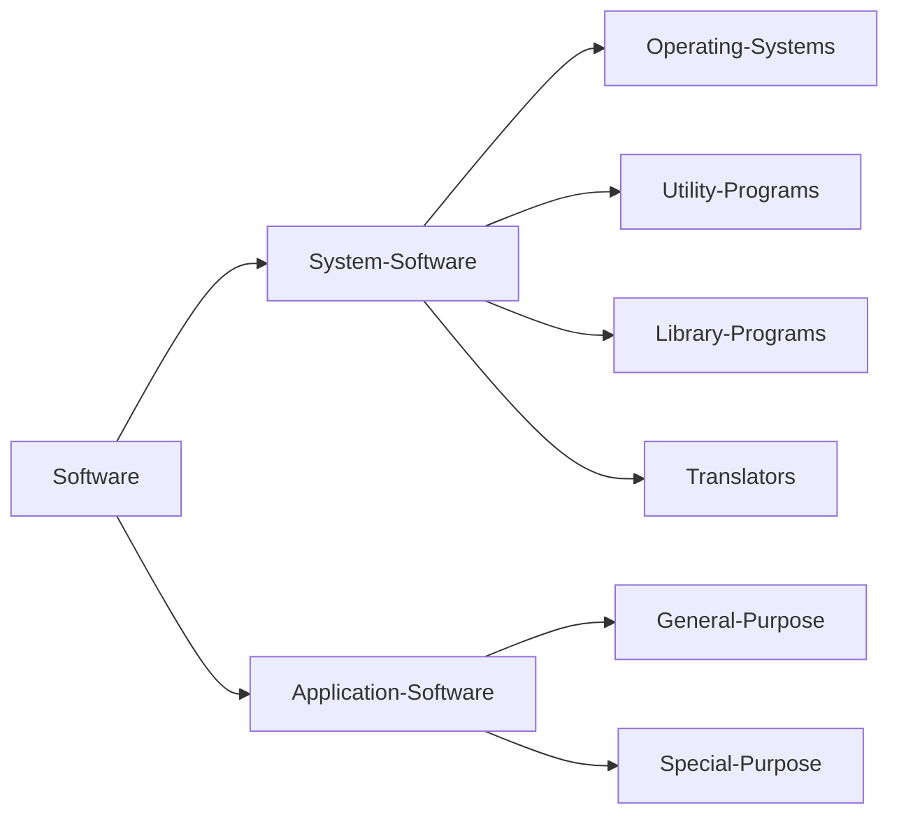

#### Hardware

Hardware describes the electrical or electro-mechanical parts of a computer system.
	These comprise the physical, tangible parts of the computer and its input, output and storage devices.

#### Software

Software comprises all of the programs that make the computer function.
    Software doesn’t have a physical presence but rather stored as data. Software programs fit into two categories: [[#System software]] or [[#Application software]]

## System Software

System software is required to run and manage the computer’s hardware and application programs.
Examples include:
- Allocating jobs to the processor.
- Peripheral management.
- Maintaining security and checking for viruses.
- Software installation.
- Translating program code into machine code.

### Operating System

An operating system serves as a middle-man for communication between the computer’s hardware and software.
    Software applications cannot talk directly to hardware.
Some tasks of an OS include:
- Resource management.
- Provision of a user interface.

### Utility Software

Some utility software is designed to analyse, configure, optimise or maintain a computer system.
    Defragment a disk, install/uninstall software, keep software up-to-date, monitor resources and performance, etc.
Some utilities perform additional common tasks needed by most or all users
    Virus checkers, Automatic backup and restore, File compression software.

### Libraries

A library is a collection of pre-compiled routines that can be used by other programs. Most operating systems have hundreds of library files which can be shared by multiple processes.

### Translators and Machine Code

Machine code is the lowest level of instruction comprising of pure binary. A translator is used to translate code written in high level code into machine code.
- Assemblers translate assembly language into machine code
- Compilers translate high-level language programs into machine code which can be saved and run whenever needed, without the compiler.
- Interpreters also translate high-level language programs. Goes line by line.

## Application Software

Application software allows you to complete different tasks.

### General Purpose

General purpose software packages can be used for a range of generic tasks, ie word processors or spreadsheet software.

### Special Purpose

Special purpose software performs tasks for a single, specific job, ie calendar programs or media players.

### Off-the-shelf

Off the shelf software is software already made and and is generally more [[#General purpose]] or just very well used.
- Costs are usually lower and the software is likely more well-documented.
- However it may not be perfect and you have little control over what features there are.

### Bespoke

Bespoke software is software created to fulfil your own exact specifications.
- Significantly increases cost and may take a long time to create.
- However it gives you complete control over the process to give all the functionality you need.
