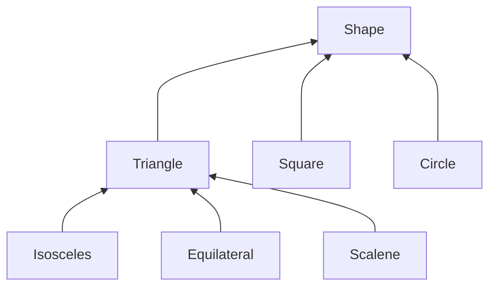
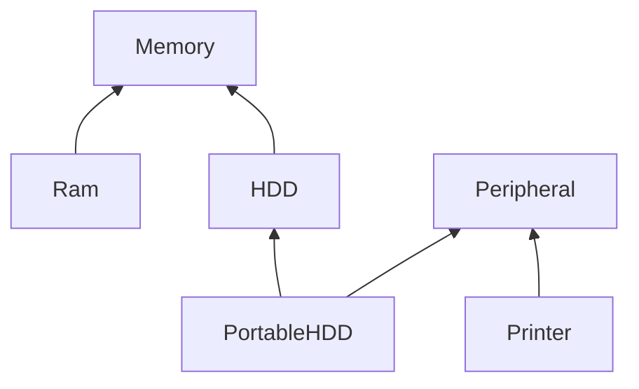

Inheritance is a very important part of OOP development. It allows you to define a class based on a existing class, you just specify how a new class differs from a existing class.
Inheritance (allegedly) gives the benefits of :
- Improved OO model
- Faster development
- Smaller code base

## Super/Sub classes
The subclass inherits everything from the superclass (except constructors)
- You can define additional variable and methods.
- You can override existing methods from the superclass.
- You can access non-private members defined in the superclass.
- You typically have to define constructors too.
- A class can have several subclasses.
- Inheritance is a "is a" relationship

### Constructors 
Constructors are not inherited and instead defined in the base class. Constructors must have the same name as the class in which it resides without a return type.

## Polymorphism
Refers to a programming language's ability to process objects differently depending on their data type or class. A derived class may need to do more than just extend a class. A method inherited from a base class can be redefined so that it behaves differently to the base class.

Polymorphism is achieved by using the key words : [[#Virtual]] and [[#Override]]

### Virtual
A virtual method is defined in the base class using the key word but can be overridden by a method in the sub class.

### Override
Defining a method with the same name and formal argument types as a method from a superclass is called overriding and is achieved by using the key word.

## Single and Multiple Inheritance

A subclass can itself be a base class for another subclass leading to a hierarchy of classes.

Single Inheritance is occurs when a class inherits from one parent. Multiple occurs when a class inherits from more than one, this gives more power to an OOP language because many base classes can be setup from it.

