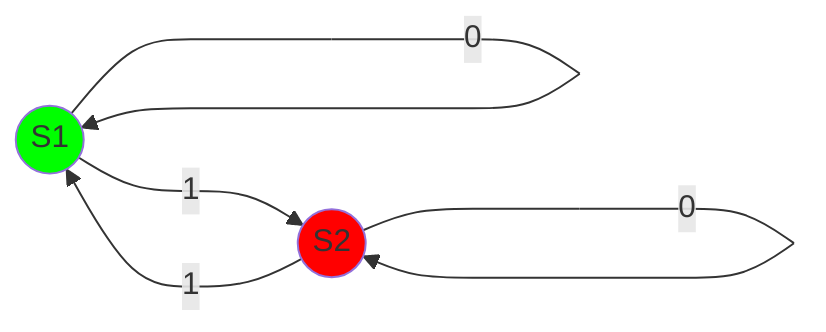
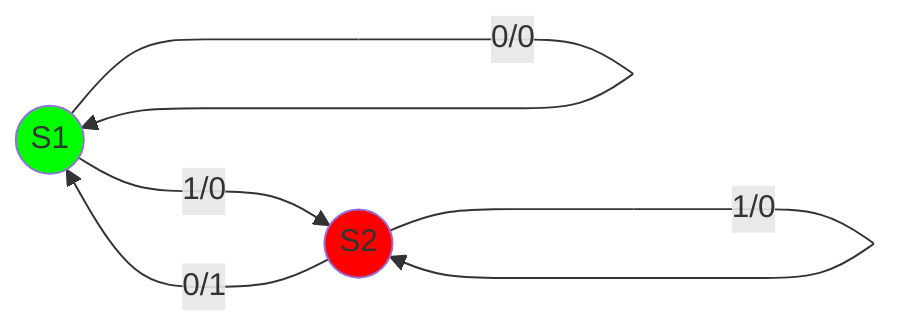

A finite state machine is an abstract model of computation used to design computer programs and  sequential logic circuits, test for valid syntax, etc. It is a abstract representation of how something changes in response to an event.

(Green for start state, Red for accept state)

## Mealy machine

A mealy machine is a type of FSM. It generates an output on each state transition.
The output is determined by its current state and its current input.

This can be used to map out an input sequence to an output sequence.
This can be placed in a table:

| Input | Current State | Output | Next State |
| ----- | ------------- | ------ | ---------- |
| 0     | S1            | 0      | S1         |
| 1     | S1            | 1      | S2         |
| 1     | S2            | 0      | S2         |
| 0     | S2            | 1      | S1         | 
